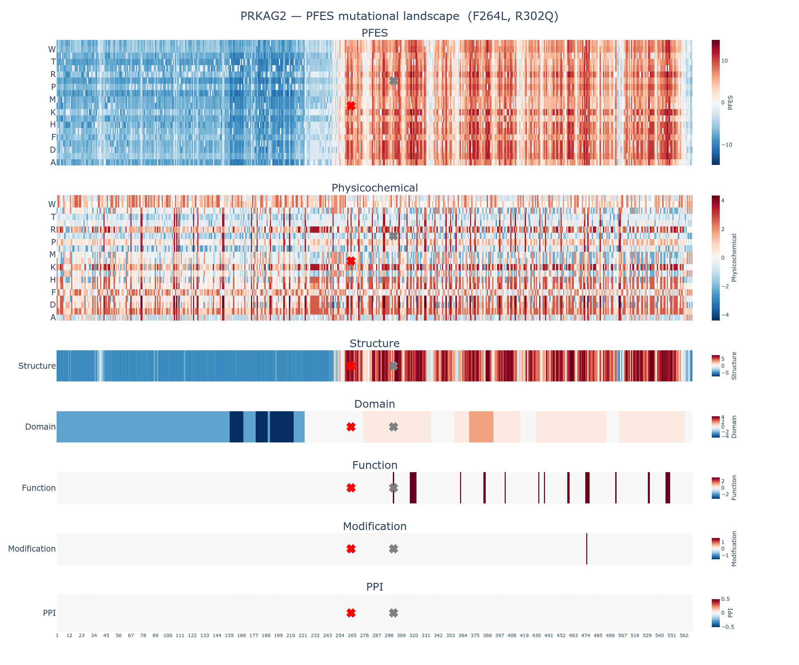

# Variant Summary Report: PRKAG2:R302Q

This report summarizes the protein feature enrichment score (PFES) for the variant R302Q (Arginine to Glutamine at position 302) in PRKAG2, a member of the **protein-binding activity modulator** protein family.

---

## 1. PFES Summary

| | |
|---|---|
| **Overall PFES** | 5.005 |
| **PFES Category** | PF-Neutral (*p* = 1.07e-01) |
| **PFES_Physicochemical** | -1.720 (Physicochemical-Neutral, *p* = 6.97e-01) |
| **PFES_Structure** | 3.021 (Structure-Neutral, *p* = 3.00e-01) |
| **PFES_Domain** | 0.410 (Domain-Neutral, *p* = 3.74e-01) |
| **PFES_Function** | 3.294 (Function-Enriched) |
| **PFES_Modification** | — (no significant features) |
| **PFES_PPI** | — (no significant features) |

The variant R302Q in PRKAG2 is classified as **PF-Neutral**, indicating that its protein feature profile is statistically consistent with both pathogenic and control variant distributions. No single attribute shows significant enrichment in either direction.

---

## 2. Feature Attribution

| Attribute | PFES | Feature | OR | q-value | Interpretation |
|---|---|---|---|---|---|
| Physicochemical | -1.720 | Reference residue class (Positively-Charged) | 0.75 | 1.04e-05 | R302 is a positively-charged amino acid |
| | | Residue class change (Positively-Charged → Polar/Neutral) | 0.64 | 3.61e-05 | Substitution class: Positively-Charged → Polar/Neutral |
| | | Grantham distance = 43 (Mild) | 0.37 | 1.05e-75 | Mild physicochemical shift |
| Structure | 3.021 | Intra-protein non-bonded interaction | 6.2 | 7.20e-243 | Residue participates in intra-protein non-bonded contacts |
| | | AlphaFold2 confidence (Very high, pLDDT > 90) | 4.1 | 1.49e-156 | Very high AlphaFold2 prediction confidence |
| | | Solvent accessibility (Medium-buried, RSA 25–50%) | 0.80 | 8.17e-04 | Residue is medium-buried (solvent accessibility) |
| Domain | 0.410 | Domain | 1.5 | 2.94e-12 | R302 falls within a domain region |
| Function | 3.294 | Binding site | 27.0 | 2.95e-72 | R302 is annotated as binding site |
| Modification | — | — | — | — | No modification annotations identified at R302 |
| PPI | — | — | — | — | No ppi annotations identified at R302 |

---

## 3. PFES Landscape

The full mutational landscape for PRKAG2 is available in the accompanying interactive figure:
[PRKAG2_R302Q_landscape.html](PRKAG2_R302Q_landscape.html)