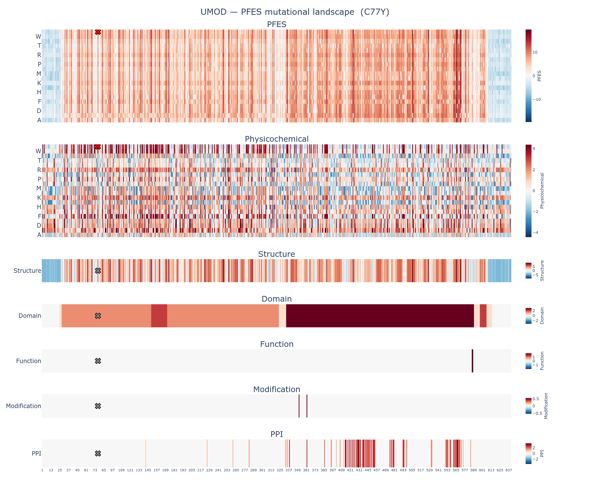

# Variant Summary Report: UMOD:C77Y

This report summarizes the protein feature enrichment score (PFES) for the variant C77Y (Cysteine to Tyrosine at position 77) in UMOD, a member of the **transmembrane signal receptor** protein family.

---

## 1. PFES Summary

| | |
|---|---|
| **Overall PFES** | 10.917 |
| **PFES Category** | PF-Enriched (*p* = 4.73e-03) |
| **PFES_Physicochemical** | 4.313 (Physicochemical-Enriched, *p* = 3.62e-03) |
| **PFES_Structure** | 5.103 (Structure-Neutral, *p* = 1.32e-01) |
| **PFES_Domain** | 1.502 (Domain-Neutral, *p* = 1.08e-01) |
| **PFES_Function** | — (no significant features) |
| **PFES_Modification** | — (no significant features) |
| **PFES_PPI** | — (no significant features) |

The variant C77Y in UMOD is classified as **PF-Enriched** (*p* = 4.73e-03), indicating that its protein feature profile is enriched among known pathogenic variants. This classification is primarily driven by **physicochemical** features.

---

## 2. Feature Attribution

| Attribute | PFES | Feature | OR | q-value | Interpretation |
|---|---|---|---|---|---|
| Physicochemical | 4.313 | Residue class change (Special → Aromatic) | 7.8 | 5.13e-73 | Substitution class: Special → Aromatic |
| | | Grantham distance = 194 (Severe) | 3.7 | 3.95e-125 | Severe physicochemical shift |
| | | Reference residue class (Special) | 2.6 | 2.64e-94 | C77 is a special amino acid |
| Structure | 5.103 | Intra-protein disulfide bond | 50.7 | 2.88e-179 | Residue participates in intra-protein disulfide bond |
| | | Intra-protein non-bonded interaction | 3.1 | 4.98e-176 | Residue participates in intra-protein non-bonded contacts |
| | | Solvent accessibility (Buried, RSA 5–25%) | 2.2 | 2.33e-65 | Residue is buried (solvent accessibility) |
| | | AlphaFold2 confidence (High, pLDDT 70–90) | 0.86 | 5.07e-04 | High AlphaFold2 prediction confidence |
| | | Secondary structure (C, loop/coil) | 0.57 | 3.58e-36 | C77 adopts Secondary structure (C, loop/coil) conformation |
| Domain | 1.502 | Domain | 2.6 | 2.58e-132 | C77 falls within a domain region |
| | | Chain | 1.7 | 6.37e-05 | C77 falls within a chain region |
| Function | — | — | — | — | No function annotations identified at C77 |
| Modification | — | — | — | — | No modification annotations identified at C77 |
| PPI | — | — | — | — | No ppi annotations identified at C77 |

---

## 3. PFES Landscape

The full mutational landscape for UMOD is available in the accompanying interactive figure:
[UMOD_C77Y_landscape.html](UMOD_C77Y_landscape.html)