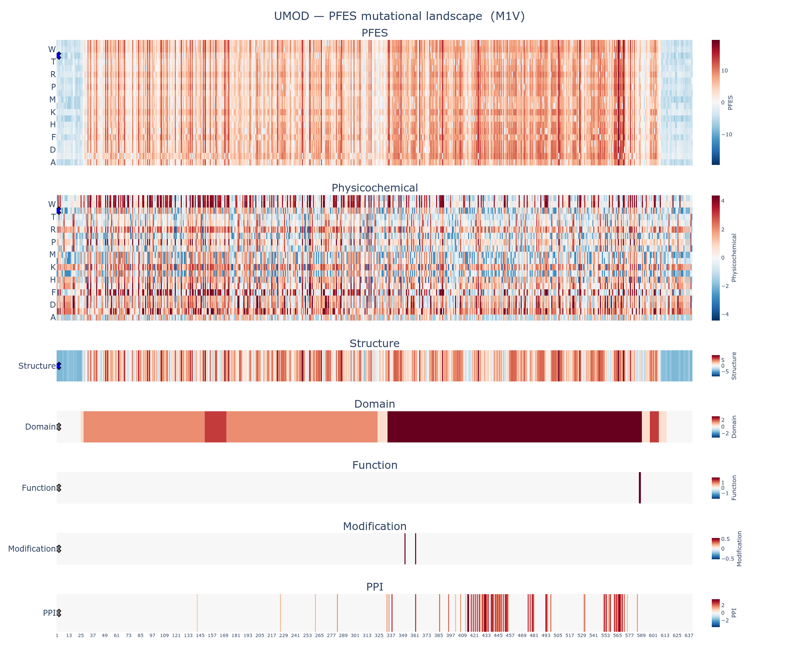

# Variant Summary Report: UMOD:M1V

This report summarizes the protein feature enrichment score (PFES) for the variant M1V (Methionine to Valine at position 1) in UMOD, a member of the **transmembrane signal receptor** protein family.

---

## 1. PFES Summary

| | |
|---|---|
| **Overall PFES** | -6.984 |
| **PFES Category** | PF-Depleted (*p* = 8.36e-01) |
| **PFES_Physicochemical** | -2.784 (Physicochemical-Depleted, *p* = 9.28e-01) |
| **PFES_Structure** | -4.200 (Structure-Depleted, *p* = 7.13e-01) |
| **PFES_Domain** | — (no significant features) |
| **PFES_Function** | — (no significant features) |
| **PFES_Modification** | — (no significant features) |
| **PFES_PPI** | — (no significant features) |

The variant M1V in UMOD is classified as **PF-Depleted** (*p* = 1.58e-02), indicating that its protein feature profile is depleted of features associated with pathogenic variants. This classification is primarily driven by **structure** features.

---

## 2. Feature Attribution

| Attribute | PFES | Feature | OR | q-value | Interpretation |
|---|---|---|---|---|---|
| Physicochemical | -2.784 | Reference residue class (Aliphatic) | 0.70 | 4.93e-20 | M1 is a aliphatic amino acid |
| | | Grantham distance = 21 (Mild) | 0.31 | 1.79e-182 | Mild physicochemical shift |
| | | Residue class change (Aliphatic → Aliphatic) | 0.28 | 9.72e-118 | Substitution class: Aliphatic → Aliphatic |
| Structure | -4.200 | Secondary structure (C, loop/coil) | 0.57 | 3.58e-36 | M1 adopts Secondary structure (C, loop/coil) conformation |
| | | AlphaFold2 confidence (Very low, pLDDT < 50) | 0.17 | 7.82e-171 | Very low AlphaFold2 prediction confidence |
| | | Solvent accessibility (Exposed, RSA > 75%) | 0.15 | 6.89e-120 | Residue is exposed (solvent accessibility) |
| Domain | — | — | — | — | No domain annotations identified at M1 |
| Function | — | — | — | — | No function annotations identified at M1 |
| Modification | — | — | — | — | No modification annotations identified at M1 |
| PPI | — | — | — | — | No ppi annotations identified at M1 |

---

## 3. PFES Landscape

The full mutational landscape for UMOD is available in the accompanying interactive figure:
[UMOD_M1V_landscape.html](UMOD_M1V_landscape.html)